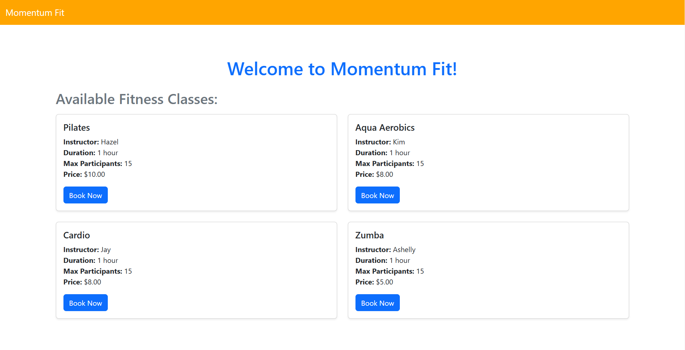
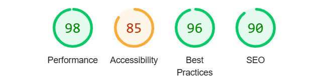
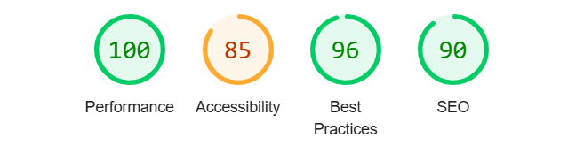

# MOMENTUM FIT

[This is a link to the live website](https://momentum-fit-f8d448119d40.herokuapp.com/)

## Table Of Contents
- [Introduction](#introduction)
- [Design](#design) 
  * [User Feedback](#user-feedback)
- [Application Features](#application-features)
  * [Data/APIs Used](#dataapis-used)
- [UX (User Experience)](#user-experience)
- [Accessibility](#accessibility)
- [Future Features](#future-features)
- [Testing](#testing)  
- [Deployment](#deployment)
- [Technologies](#technologies)
- [Code](#code)  
- [Acknowledgements](#acknowledgements) 

## Introduction
Momentum Fit is a fitness tracking and workout management platform designed to help users track their workouts, set fitness goals, and monitor their progress over time. The user-friendly interface ensures an engaging experience, making it easier for individuals to stay motivated and achieve their fitness goals.

# Design
  ### User Feedback
- Workout Logging Success: "Workout logged successfully! Keep it up!"
- Goal Achievement: "Congratulations on reaching your fitness goal!"
- Error: "Sorry, the class Pilates is already full!"

## Application Features
- 4 classes available: Pilates, Cardio, HydroHiit and Zumba, all of them at the same time 1400hrs. 
- Each class takes a maximum of 15 users.
- Book now button.
- Confirmation that a user has booked a class.

## Data/APIs Used
- Django ORM: Utilized for managing workout and user data efficiently.

## User Experience
### As a first time user:
 - I want to see all the available classes.
 - I want to see how much the classes are.
 - I want to see the name of the instructor.
 - I want to see how long the class is.
 - I want to book a class.
 - I want to get confirmation that I have booked a class.

## Accessibility
- Color Contrast: Ensures adequate contrast for readability, particularly for users with visual impairments.
-  Keyboard Navigation: All key features can be accessed via keyboard for users with mobility challenges.
- Screen Reader Compatibility: The app is designed to be compatible with screen readers for users with visual disabilities.
- Error Messages: Detailed error messages are provided to guide users in correcting any issues with their input.

## Future Features
- Payment Gateway Integration: Allow users to pay for bookings directly through the system.
- Integration with Wearable Devices: Integrate with fitness trackers and wearables like Fitbit, Apple Watch, etc.
- Diet and Nutrition Tracking: Add functionality to track daily food intake and calories burned.
- Mobile App: A mobile version for more on-the-go functionality, including workout logging and notifications.
- Social Sharing: Users can share their workout achievements on social media.
- Advanced Reporting: More detailed statistics and insights into users’ fitness progress over time.
- Leave reviews.

## Testing
### User story Testing
 - The app delivers on all first time user stories.

### Feature Testing
- Workout Selection: Ensure that users can select workout types, input data, and save it without issues.

## Deployment
### Heroku

1. Sign Up / Log In to Heroku:

- Visit Heroku and either create a new account or log in to your existing account.

2. Create a New App:
- Once logged in, click on the New button on the top right of the dashboard.
- Select Create new app.
- Choose a unique name for your app and select your region (e.g., United States or Europe).
- Click Create app.
- Set Up Heroku CLI:

3. Install the Heroku CLI if you haven’t already. You can download it from here.
After installation, open your terminal or command prompt and log in using the following command:
Copy code
heroku login
Prepare Your Code for Deployment:

4. Ensure your app has a Procfile (to specify how to run your application) and requirements.txt (which lists all the Python packages your app depends on).
Add any necessary environment variables to your code, such as SECRET_KEY, DEBUG, DATABASE_URL, etc.
Push Your Code to Heroku:

5. In your project folder, initialize Git (if you haven’t already):
- git init
- git add .
- Commit the changes:

6. Link your app to Heroku:

7. If your app uses a database (e.g., PostgreSQL), you can provision a Heroku Postgres database by running:

heroku addons:create heroku-postgresql:hobby-dev
Run database migrations to set up your database schema:

heroku run python manage.py migrate
Configure Environment Variables:

8. You can set environment variables on Heroku using the following command:

heroku config:set <VARIABLE_NAME>=<VALUE>
Ensure variables like SECRET_KEY, DEBUG, and ALLOWED_HOSTS are set up correctly.

9. Open Your Application:

10. Once the code is deployed and the database is set up, open your app by 
heroku open
Monitor Your App:

11. You can monitor logs and check for errors by running:

- heroku logs --tail

## Technologies
- Github for the source code.
- Gitpod for creating the website.
- Django: Web framework for backend logic and server-side functionality.
- Code Institute's Gitpod Template
- Heroku for deployment
- Code institute learnings
- Techsini to create a mockup of the website
- PostgreSQL: Database for storing user and booking data.
- HTML/CSS/JavaScript: Frontend design and interactivity.

## Code
- [Code Institute](https://learn.codeinstitute.net/dashboard)
- Tutorial videos- Programming with Mosh [YouTube](https://www.youtube.com/@programmingwithmosh)

## Acknowledgement
- A big thanks to Slack Community for for always being someone willing to answer my questions.

- A big thank you to the Code Institute team for their constant support and resources that made this project possible.
